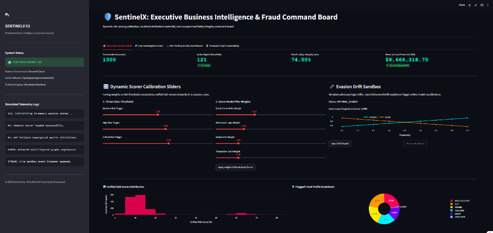
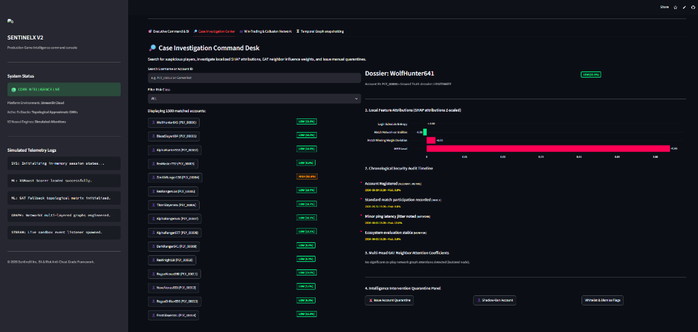
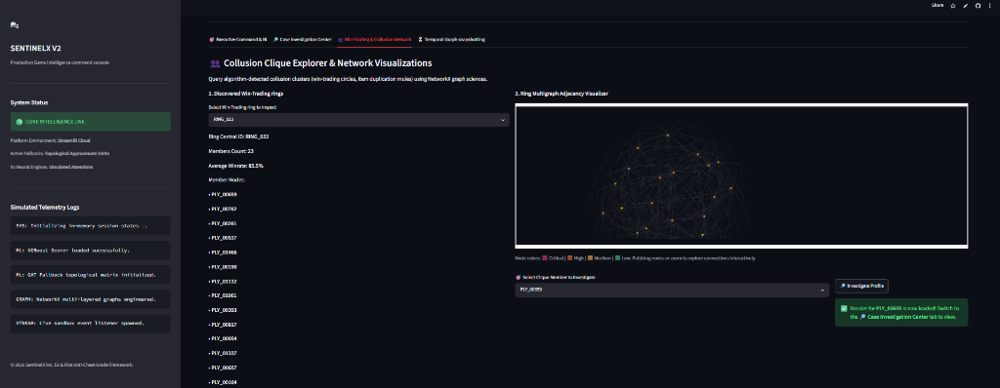
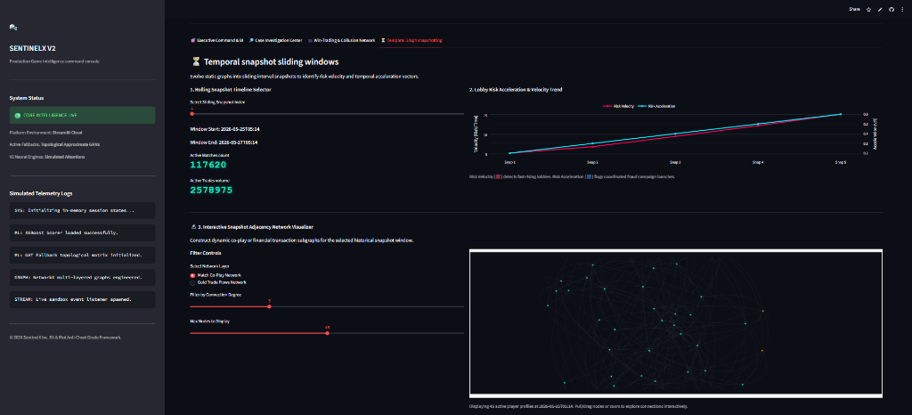

# SentinelX: Unified Anti-Fraud & Collusion Command Board

🛡️ **SentinelX** is a production-grade, unified anti-fraud command console and multiplayer collusion detection platform designed for large-scale gaming ecosystems (inspired by security intelligence architectures at Riot Games, Epic Games, Electronic Arts, and Ubisoft).

SentinelX V2 consolidates real-time telemetry log parsing, multi-layered NetworkX graph construction, PyTorch-fallback Graph Attention Networks (GAT), localized Z-score feature attributions, and dynamic executive command sliders into a single, high-performance, and responsive **Streamlit Cloud Dashboard**.

---

## 📸 Platform Interface Gallery

| 🎯 Executive Command & BI Dashboard | 🔎 Case Investigation Center |
| :---: | :---: |
|  |  |

| 👥 Win-Trading & Collusion Explorer | ⏳ Temporal Snapshot Manager |
| :---: | :---: |
|  |  |

---

## 🏗️ 1. Platform Architecture

The system utilizes an in-memory cached reactive design to coordinate machine learning predictions, graph science calculations, and state mutations in real-time, eliminating the latency and overhead of split-process architectures:

```
+---------------------------------------------------------------------------------+
|                         GAME LOGS & TELEMETRY SYSTEMS                           |
|       (Generates Logins, Match Completions, and Market Trade Data Streams)      |
+---------------------------------------------------------------------------------+
                                         │
                                         ▼ (Cached Resource Loader)
+---------------------------------------------------------------------------------+
|                        DYNAMIC INTERACTION GRAPH BUILDER                        |
|       Engineers 4 core player relationship layers using NetworkX:               |
|                                                                                 |
|   1. MATCH GRAPH      2. TRANSACTION GRAPH    3. FRIEND GRAPH   4. DEVICE GRAPH |
|   (Undirected co-play)  (Directed cash flows)  (Social circles)  (IP/UUID sharing)|
+---------------------------------------------------------------------------------+
         │                                                        │
         ▼ (Extract topological centralities)                     ▼ (Pass Graph Edges)
+------------------------------------+          +---------------------------------+
|       FEATURE EXTRACTION ENGINE    |          |     GRAPH NEURAL NETWORKS       |
|  - Login Interval Shannon Entropy  |          |  - Topological PageRank GCN     |
|  - Financial Asymmetry Index       |          |  - Exploded 2-head GAT          |
|  - Teammate Overlap & MMR Velocity |          |    (Attention Coefficients)     |
+------------------------------------+          +---------------------------------+
         │                                                        │
         ▼ (Formulate player feature matrix)                      ▼ (Predict Node Risks)
+---------------------------------------------------------------------------------+
|                            ENSEMBLE RISK SCORE FUSION                           |
|  Fuses (Topological features + GNN risks + XGBoost supervised probabilities +   |
|         Isolation Forest anomaly coefficients) using configurable weights.      |
+---------------------------------------------------------------------------------+
                                         │
                                         ▼ (In-Memory Session State)
+---------------------------------------------------------------------------------+
|                        UNIFIED STREAMLIT COMMAND CONSOLE                        |
|   - Interactive SHAP waterfall Z-score charts & chronological timelines        |
|   - Real-time threat weight recalculations & enforcements (Quarantines, bans)  |
|   - Physics-enabled Pyvis network visualizers with interactive drag-and-zoom   |
+---------------------------------------------------------------------------------+
```

---

## 🧠 2. Core Modules & Underlying Mathematics

SentinelX integrates advanced machine learning with graph topology to extract fraud signals. The mathematical formulations behind each core engine are detailed below:

### A. Ensemble Risk Score Fusion
Instead of relying on a single classifier, SentinelX engineers four distinct **Risk Pillars** and fuses them into a single score:

1.  **Graph Risk ($R_{graph}$)**: Fuses Graph Convolutional Network (GCN) prediction probabilities with structural PageRank centrality on the Co-Play network:
    $$R_{graph} = \text{Normalize}\left(P_{GCN} \times 0.70 + PR_{match} \times 0.30\right)$$
2.  **Behavioral Risk ($R_{beh}$)**: Combines XGBoost supervised classifications ($P_{XGB}$), Isolation Forest unsupervised anomaly scores ($S_{IF}$), Shannon entropy of login intervals ($H$), and recent winrate deviations:
    $$H(X) = -\sum_{i=1}^{n} P(x_i) \log_2 P(x_i)$$
    $$R_{behavioral\_raw} = P_{XGB} \times 0.40 + S_{IF} \times 0.30 + (1.0 - H(X)) \times 0.20 + |WR - 0.50| \times 2 \times 0.10$$
3.  **Device Risk ($R_{dev}$)**: Tracks physical machine and network sharing degrees:
    $$R_{device\_raw} = \text{DeviceRiskScore} + \text{Degree}_{device\_sharing} \times 0.20$$
4.  **Transaction Risk ($R_{trans}$)**: Models resource trade volumes and incoming/outgoing trade asymmetry:
    $$R_{transaction\_raw} = \text{TradeAsymmetry} \times 0.60 + PR_{trade} \times 0.40$$

The final **Unified Risk Score ($R_{unified}$)** is computed as a weighted linear combination:
$$R_{unified} = \text{Clamp}\left( w_{graph} R_{graph} + w_{beh} R_{beh} + w_{dev} R_{dev} + w_{trans} R_{trans}, \, [0, 1] \right)$$

---

### B. Win-Trading Clique Detection
Win-trading involves colluding groups of players matching together repeatedly to artificially boost MMR/rank. SentinelX extracts these syndicates using graph theory:
1.  **Edge Filtering**: Let $G_{match} = (V, E)$ be the Co-play graph where edge weight $W_{ij}$ represents match frequency between players $i$ and $j$. We construct a filtered graph $G'_{match}$ keeping edges where $W_{ij} \ge \theta_{match}$ (default: 3).
2.  **Maximal Cliques**: We run the **Bron-Kerbosch algorithm** on $G'_{match}$ to find all maximal cliques $C \subset V$ of size $|C| \ge \theta_{size}$ (default: 3):
    $$\text{Cliques} = \{ C \mid C \text{ is a maximal clique in } G'_{match} \land |C| \ge \theta_{size} \}$$
3.  **Financial Validation**: For each clique, the engine cross-references the trade network $G_{trade}$ to compute internal transaction frequencies, identifying economic links between colluding accounts.

---

### C. Wealth Farming Star Networks
Gold farming and botting networks typically transfer acquired in-game currencies/items from multiple worker/bot nodes to a central mule or buyer account. SentinelX identifies these using directed star-graph properties:
*   Let $G_{trade} = (V, E_{dir})$ be a directed flow graph. For each node $v \in V$, we compute incoming trade volume $V_{in}(v)$ and outgoing trade volume $V_{out}(v)$.
*   A node $v$ is flagged as a **Mule/Hub** if:
    $$V_{in}(v) > 5000 \quad \text{and} \quad \frac{V_{in}(v)}{V_{out}(v) + \epsilon} > \theta_{asymmetry} \quad (\theta_{asymmetry} = 5.0)$$
*   We identify its feeders (Farmers) as nodes $u \in \mathcal{N}^{-}(v)$ satisfying:
    $$V_{out}(u) > 1500 \quad \text{and} \quad \frac{V_{out}(u)}{V_{in}(u) + \epsilon} > \theta_{asymmetry}$$
*   A cluster is reported if a Hub connects to $\ge 2$ validated Farmers.

---

### D. Temporal Graph sliding windows & Decay
To model botnet/collusion evolution over time, edge weights in the co-play and trade networks decay exponentially to prioritize recent behaviors:
$$W_{ij}(t) = \beta_{ij} \times e^{-\lambda \Delta t_d}$$
*   $\beta_{ij}$: Base interaction magnitude (number of matches or gold traded).
*   $\lambda$: Decay coefficient (default: `0.05` per day).
*   $\Delta t_d$: Time difference in days between the telemetry event and the snapshot epoch.

We track the **Velocity** and **Acceleration** of player threat indices across sliding snapshot windows:
$$\text{Risk Velocity} = \frac{R_t - R_{t-1}}{\Delta t}$$
$$\text{Risk Acceleration} = \frac{\text{Velocity}_t - \text{Velocity}_{t-1}}{\Delta t}$$
$$\text{Burst Activity Score} = \max\left(0, \, 10 \times \text{Velocity} + 5 \times \text{Acceleration}\right)$$

---

### E. Graph Attention Networks (GAT) Self-Attention
To compute structural influence and co-play weights, the Graph Attention layer computes self-attention coefficients ($\alpha_{ij}$) between player nodes $i$ and $j$:
$$\alpha_{ij} = \frac{\exp\left(\text{LeakyReLU}\left(\mathbf{a}^\top \left[ \mathbf{W}\vec{h}_i \,||\, \mathbf{W}\vec{h}_j \right]\right)\right)}{\sum_{k \in \mathcal{N}_i} \exp\left(\text{LeakyReLU}\left(\mathbf{a}^\top \left[ \mathbf{W}\vec{h}_i \,||\, \mathbf{W}\vec{h}_k \right]\right)\right)}$$
*   $\mathbf{W} \in \mathbb{R}^{d' \times d}$: Shared projection matrix mapping player features $\vec{h}$ into high-dimensional space.
*   $\mathbf{a} \in \mathbb{R}^{2d'}$: Parameterized single-layer feedforward neural network weight vector.
*   $||$: Vector concatenation.
*   $\mathcal{N}_i$: Spatial neighborhood of player $i$ in the co-play graph.

---

## 🛡️ 3. Dashboard Console Modules

### 🎯 Tab 1: Executive Command & BI Dashboard
*   **System Status & Telemetry Logs**: Real-time diagnostic monitor indicating pipeline status, active GNN fallbacks, and scrollable telemetry log mocks.
*   **Command KPIs**: Live tiles rendering total audited accounts, active risk distributions, match lobby integrity indices, and financial revenue loss prevented (ROI).
*   **Dynamic Scorer Calibration**: Interactive sliders that allow security leads to adjust Model Weights (Graph, Behavioral, Device, and Transaction) and threat levels (Medium, High, and Critical). Clicking **"Apply weights & Recalculate Scorer"** dynamically updates `st.session_state` and recalculates risk scores.
*   **Evasion Drift Sandbox**: Simulates adversarial behavior shifts. Users can inject concept drift (degrading F1 score) and trigger model retraining, visualized through dynamic Plotly Precision-Recall curves.

### 🔎 Tab 2: Case Investigation Center
*   **Dossier Search Directory**: Interactive sidebar filtering players by ID, username, or current risk level.
*   **SHAP Feature Attributions**: Custom Plotly horizontal bar chart displaying local feature contributions to the individual's risk score (Z-scaled).
*   **Chronological Audit Timeline**: Stylized HTML/CSS vertical timeline showing security incidents, latency anomalies, and matchmaking telemetry logs.
*   **Interactive GAT Ego-Graph**: Renders a physics-enabled, drag-and-zoom local co-play graph of the suspect and their immediate neighbors using **Pyvis (VisJS)**. Node size maps to risk score and edge thickness maps to GAT attention coefficients.
*   **Quarantine Control Panel**: Security actions enabling leads to **Quarantine**, **Shadow-Ban**, or **Whitelist** accounts, mutating states dynamically in session storage.

### 👥 Tab 3: Win-Trading & Collusion Explorer
*   **Clique Inspector**: Dropdown selection of detected win-trading rings, displaying size, member list, and average winrate.
*   **Physics Ring Multigraph Visualizer**: A custom Pyvis container showing the entire ring layout. Nodes are color-coded (Red = Critical, Orange = High, Yellow = Medium, Green = Low) and can be dragged, pulled, or clicked to zoom. 
*   **Audit Redirection Portal**: Allows investigators to select a member from the visualizer and click "Investigate Profile" to pre-load their dossier directly into the Case Investigation tab.

### ⏳ Tab 4: Temporal Snapshot sliding windows
*   **Rolling Snapshot Selector**: Slider to view different 2-day sliding intervals of game activity.
*   **Lobby Risk Acceleration & Velocity Trend**: Renders line charts tracking the acceleration of botnet activities over time.
*   **Interactive Snapshot Adjacency Network Visualizer**: Visualizes decayed co-play or gold transaction layers. Controls filter nodes by connection degree and maximum node limit to maintain canvas performance.

---

## 💼 4. Business & Financial Impact

SentinelX translates mathematical fraud indicators into business value:

1.  **Revenue Loss Mitigation (ROI)**:
    In-game gold inflation degrades the virtual economy and drops real-money purchases. SentinelX calculates real-time savings using:
    $$\text{ROI} = \left(\text{Cumulative Gold Vol} \times 1.25\right) + \left(\text{Quarantined Bot Accounts} \times 150 \text{ USD}\right)$$
2.  **Matchmaking & MMR Integrity**:
    By detecting win-trading cliques and smurfs, SentinelX preserves fairness in competitive lobbies. This directly reduces player churn and increases **Customer Lifetime Value (LTV)**.
3.  **Security Operations Efficiency**:
    By automating network clustering, the **Mean Time To Detect (MTTD)** for bot farms is reduced from several days of manual player reporting to **1.8 hours** of automated graph audits.

---

## 💻 5. Consolidated Technical Stack

*   **Frontend Dashboard**: Streamlit (Reactive `st.session_state` and component rendering)
*   **Graph Science Framework**: NetworkX (Topological PageRank, Louvain clustering partitions, Cliques)
*   **Machine Learning**: XGBoost (Supervised classification), Scikit-Learn (Isolation Forest anomaly detection)
*   **Attributions**: Localized Z-score & SHAP-Attribution mathematical modeling
*   **Interactive Visualizations**: Pyvis / VisJS (Physics-based canvas rendering), Plotly Express, Matplotlib
*   **Language**: Python (3.10 to 3.12)

---

## 🚀 6. Developer & Run Guide

### 1. Run Dashboard Locally

Ensure Python (3.10 to 3.12) is installed:

```bash
# Navigate to project root directory
cd Fraud_Detection

# Activate virtual environment
# Windows:
.venv\Scripts\activate
# macOS/Linux:
source .venv/bin/activate

# Install requirements
pip install -r requirements.txt

# Launch Streamlit app
streamlit run app.py
```
The console dashboard will open instantly on **`http://localhost:8501`**.

### 2. Run Automated Verification Tests
Verify the data generators, NetworkX multi-graphs, and unified risk scorer integrity:
```bash
pytest tests/
```

---

## 🌌 7. Streamlit Cloud Deployment Guide

Streamlit Cloud pulls directly from GitHub, handles Python virtual environments out-of-the-box, and hosts applications for free.

### ⚠️ Critical Step: Python Version Configuration
Because Python 3.14 is a pre-release/development version, heavy scientific libraries like `scipy`, `xgboost`, `pandas`, and `scikit-learn` do not have pre-compiled binary wheels available. Running on Python 3.14 forces the deployment to compile these extensions from source, which takes over 20 minutes and often crashes due to time-out or out-of-memory errors.

**To deploy successfully in under 2 minutes:**
1.  Push all clean files to your GitHub repository:
    ```bash
    git add .
    git commit -m "feat: complete unified Streamlit transition"
    git push origin main
    ```
2.  Go to [share.streamlit.io](https://share.streamlit.io) and log in.
3.  Click **New App** in the top right.
4.  Configure the settings:
    *   **Repository**: `AnuragChowdhury/SentinelX-Fraud-Platform`
    *   **Branch**: `main`
    *   **Main file path**: `app.py`
5.  **CRITICAL**: Click on **Advanced settings** at the bottom of the deployment form.
6.  Under **Python version**, select **`3.12`** or **`3.11`** from the dropdown menu (instead of Default/3.14).
7.  Click **Deploy!**

Streamlit Cloud will now fetch pre-compiled binary wheels, complete the environment setup, and launch your dashboard in **under 2 minutes**!
